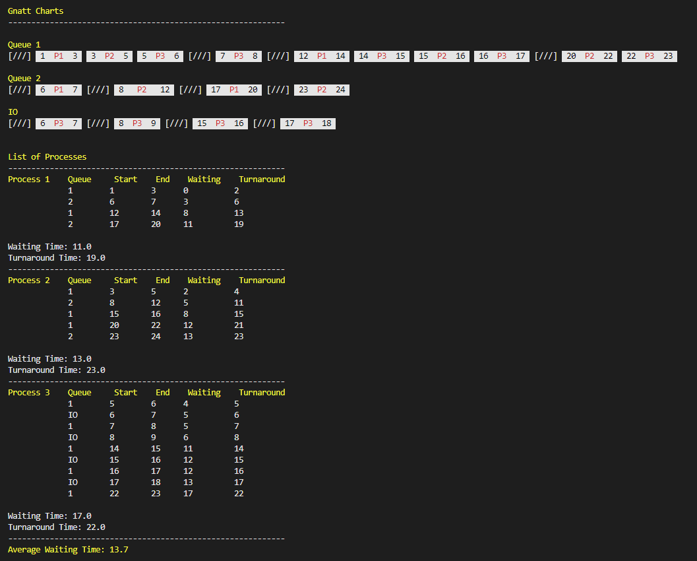

# Multilevel Feedback Queue

This project was implemented as one of the requirements for the course CSOPESY.

### Rules:

1. If Priority(A) > Priority(B), A runs (B doesn’t).

2. If Priority(A) = Priority(B), A & B run in RR.

3. When a job enters the system, it is placed at the highest priority (the topmost queue).

4. Once a job uses up its time quantum at a given level (regardless of how many times it has given up the CPU e.g. during an IO burst), its priority is reduced (i.e., it moves down one queue).

5. After some time period S, move all the jobs in the system to the topmost queue.

## Input:

- The first line contains 3 integers separated by space, X Y S.

  - X denotes the CPU scheduling algorithm.
  - Y denotes the number of processes where 3 ≤ Y ≤ 100
  - S denotes the time period for the priority boost.

- There will be X lines of space-separated integers A B C.

  - A is the queue ID,
  - B is the priority, and
  - C is the e time quantum for this queue.

- There will be Y lines of space-separated integers F G H I J.
  - F is the process ID,
  - G is the arrival time, and
  - H is the total execution time.
  - I is the length of the IO burst.
  - J is the frequency of the IO burst.

## Sample Output:

